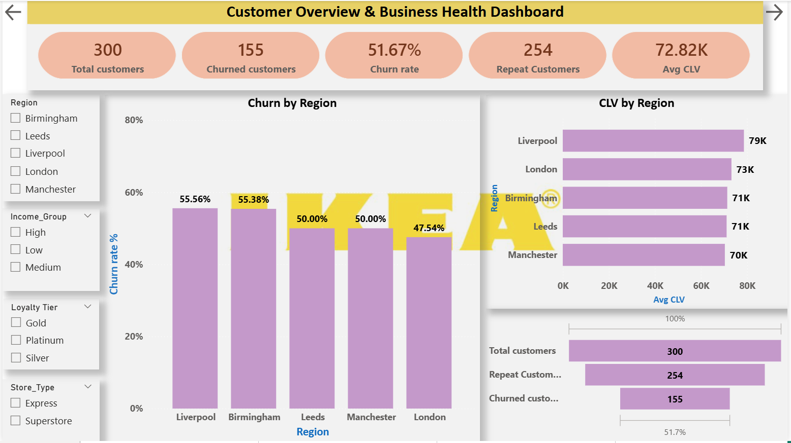
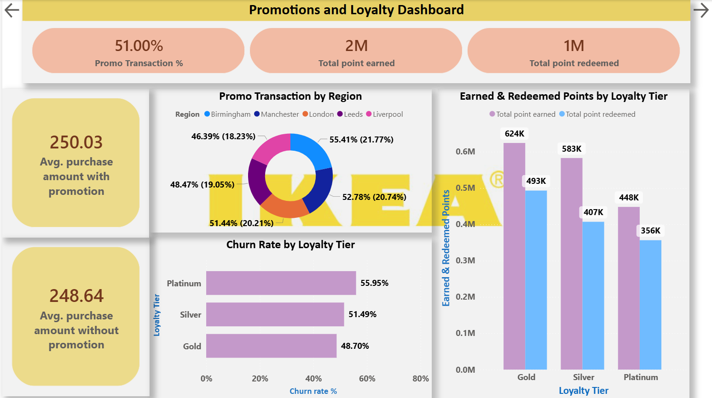
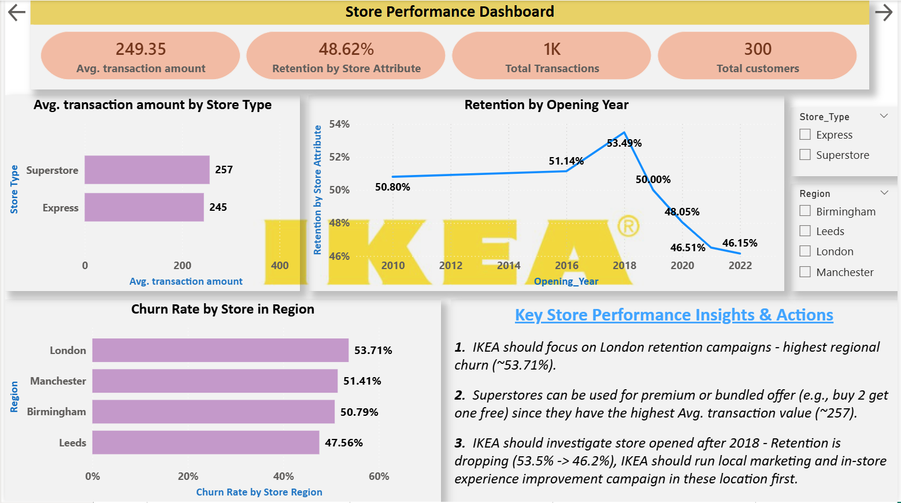
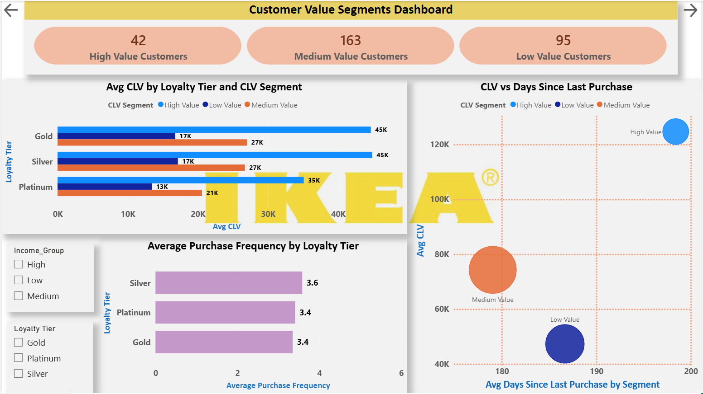
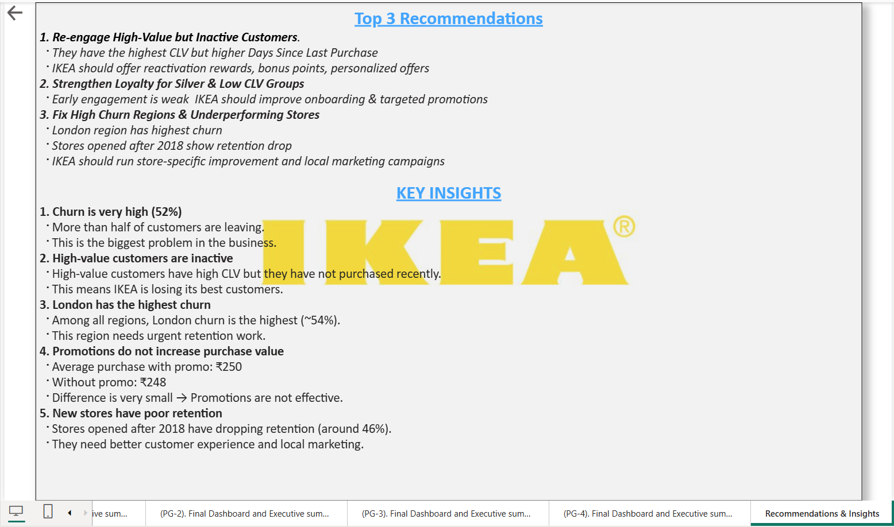

# IKEA Customer Retention Analytics (Power BI Project)

## Project Overview
This project analyzes IKEA’s customer data to understand **customer churn**, **repeat behavior**, **loyalty program effectiveness**, **store performance**, and **customer lifetime value (CLV)**.

With increasing competition from online furniture brands and local retailers, customer retention has become critical for IKEA’s long‑term growth.  
This project helps identify **why customers leave**, **who the most valuable customers are**, and **where IKEA should focus to improve retention and revenue**.

---

## Business Problems Addressed
This analysis answers the following key business questions:

- Why are customers becoming inactive or churning?
- Which customers are loyal and which are at risk?
- Do promotions and loyalty points actually work?
- Which regions and store types perform poorly?
- Who are the high‑value customers and how can IKEA retain them?

---

## Tools & Skills Used
- **Power BI**
  - Data Modeling & Relationships
  - DAX Measures & Calculated Columns
  - Interactive Dashboards
- **DAX**
  - Churn Rate, Repeat Customers
  - Promotion Metrics
  - Store‑level Churn
  - Customer Lifetime Value (CLV)
  - Customer Segmentation
- **Power Query**
  - Data Cleaning & Transformation
- **Business Analytics & Storytelling**

---

## Key Insights
- **Overall churn is very high (~52%)**, meaning more than half of customers are leaving.
- **High‑value customers are inactive** — they have the highest CLV but have not purchased recently.
- **London region has the highest churn (~54%)**, making it a high‑risk area.
- **Promotions do not increase purchase value**
  - Avg purchase with promo ≈ ₹250  
  - Avg purchase without promo ≈ ₹248  
  - Difference is very small.
- **New stores opened after 2018 have poor retention (~46%)**, indicating operational or experience issues.

---

## Final Executive Dashboards
This project includes a **4‑page executive summary dashboard**, designed for business leaders:

### 1. Customer Overview & Business Health
- Total customers, churn rate, repeat customers, and average CLV
- Churn and CLV comparison by region
- Highlights high‑risk, high‑value regions like Liverpool and Birmingham



### 2. Promotions & Loyalty Impact
- Promotion usage and average purchase comparison
- Loyalty points earned vs redeemed
- Churn by loyalty tier (Platinum shows highest churn)



### 3. Store & Region Insights
- Store type performance (Superstore vs Express)
- Retention trend by store opening year
- Regional churn analysis (London highest)



### 4. Customer Value Segments (CLV)
- High, Medium, and Low value customer segmentation
- CLV vs days since last purchase
- Identification of high‑value but inactive customers




### Final Recommendations and Key Insights
This page summarizes overall findings and converts analysis into clear business actions.



---

## Top Business Recommendations
1. **Re‑engage High‑Value but Inactive Customers**  
   - They generate the highest CLV but have not purchased recently.  
   - Use bonus points, reactivation offers, and personalized campaigns.

2. **Strengthen Loyalty for Silver & Low‑CLV Customers**  
   - Silver customers purchase frequently but have low CLV.  
   - Improve onboarding and targeted promotions to move them into higher value segments.

3. **Fix High‑Churn Regions & Underperforming Stores**  
   - London has the highest churn.  
   - Stores opened after 2018 show declining retention.  
   - Focus on store experience improvements and local marketing campaigns.

---

## Repository Structure
```
IKEA-Customer-Retention-Analytics/
│
├── README.md
├── Report/
│   └── IKEA_Customer_Retention_Project.pdf
├── PowerBI/
│   └── IKEA_Customer_Retention.pbix
├── Data/
│   ├── Customer_Demographics.csv
│   ├── Customer_Transactions.csv
│   ├── Churn_Labelled_Customers.csv
│   ├── Loyalty_Program.csv
│   └── Store_Locations.csv
└── Screenshots/
├── Final_Page_1_Overview.png
├── Final_Page_2_Promotions_Loyalty.png
├── Final_Page_3_Store_Performance.png
├── Final_Page_4_Customer_Value.png
└── Final_Recommendations_Insights.png
```

---

## Why This Project Matters
This project demonstrates:
- End‑to‑end analytics workflow
- Strong DAX and data modeling skills
- Ability to convert data into **business decisions**
- Clear storytelling for non‑technical stakeholders

---

## Video Walkthrough
A short video explaining the dashboards, insights, and business recommendations:

https://www.loom.com/share/46a8532e46174891b69267f5608e7b93

---

## Author

**Dheeraj Marmat**  
Data Analyst Portfolio Project
